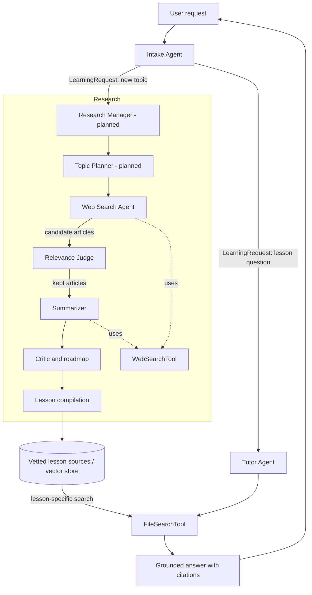

### General Flow
1. input topic
2. Generate Topology

in: prompt for what we want to learn
### Research
- **Topic Planning Agent: plans topics**
	- background research for a technology (theory)
	- Use cases for technology
	- How to use the technology for a given tech stack
- **Web Search Agent**
- JEV — Matching — if the given topic and results from websearch agent are a good match
- **Summarize Agent** — Of each good match
- **Identifying Gaps of Topics**
	- *Fact Checker/Devils Advocate*

### Artifacts of Research
- List of Articles + summary 
- Road Map: Categorization & Topology of Topics

### Compilation 
- **Lesson Planning Agent**
	- (pre conditions & post conditions for each lesson)
	- Learning goals per lesson
- **Lesson Writer Agent**
- **Interactive Converter Agent**

### Artifacts of Compilation
- Lesson Pages inside Application

## Agent workflow

The intended handoffs use typed data: Intake returns a `LearningRequest`; web search returns candidate title/URL/snippet results; the summarizer returns article summaries; and the tutor returns an `Answer` with citations. Web search and summarization use `WebSearchTool`; tutoring searches the selected lesson's vector store with `FileSearchTool`.

**Implementation status:** Intake, web search, summarizer, and tutor agents are defined. The research manager and topic planner are still placeholders, and the end-to-end routing, article filtering, storage, and research-to-compilation handoffs are not wired yet. The diagram shows the target workflow, not a currently running pipeline.